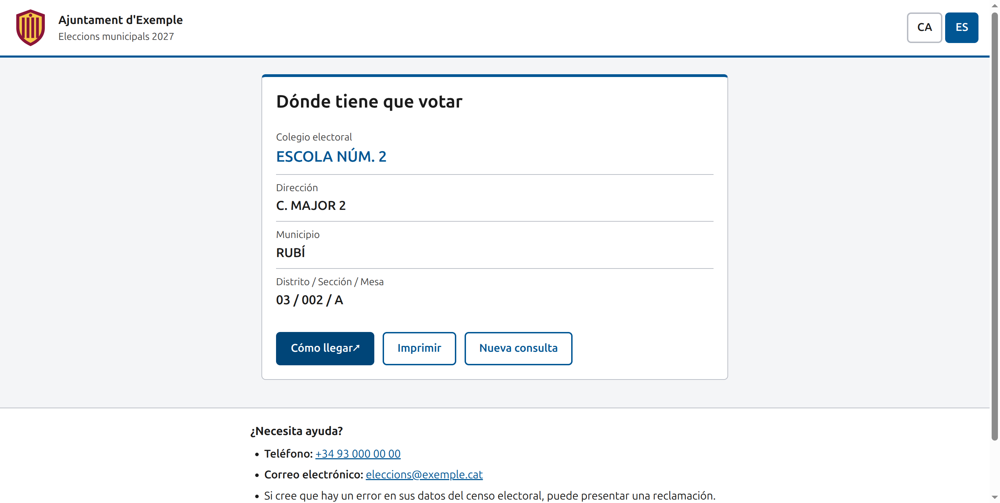

# Consulta del censo electoral — cliente web

Web pública para que cualquier ciudadano consulte **dónde le toca votar** (colegio electoral, dirección, distrito, sección y mesa) a partir de su documento de identidad.

Es el cliente del microservicio [consulta-censo-electoral](https://github.com/videoatencion/consulta-censo-electoral), que indexa el censo del INE. Pensada para ayuntamientos y consejos comarcales: accesible (WCAG 2.1 AA, RD 1112/2018), en catalán y castellano, configurable sin recompilar y sin guardar ningún dato personal.



## ¿Cómo funciona?

TL;TR
```shell
git clone https://github.com/videoatencion/consulta-censo-electoral-web.git
cd consulta-censo-electoral-web
cp config.example.json config.json && cp public/logo.svg logo.svg
mkdir data && cp /ruta/al/censo.txt data/
TOKEN=$(openssl rand -hex 32) docker compose up -d --build
```
y abra http://localhost:8080.

1. El ciudadano escribe **sólo la parte del documento que el microservicio indexa** (por defecto, los últimos 5 caracteres del DNI o NIE con la letra). Si lo escribe entero, la web comprueba la letra de control para detectar errores de tecleo y lo recorta antes de enviarlo: **el documento completo no sale nunca del navegador**. También se aceptan pasaportes y documentos de ciudadanos de la UE (CERE), que se recortan con la misma regla.
2. Si el documento basta, se muestra el colegio electoral.
3. Si varias personas comparten los datos indexados, el microservicio devuelve los campos que las distinguen, **ordenados de más a menos útil**. La web pregunta **sólo uno cada vez**: el que mejor desempata. Si el ciudadano no lo sabe («No lo sé»), pasa al siguiente. Con cada respuesta se vuelve a consultar, hasta que se determina la mesa.
4. Si no se encuentra al ciudadano o no se puede desempatar, se muestra el teléfono y el correo de ayuda y el enlace al trámite de reclamación del censo de la sede electrónica.

El resultado incluye un enlace «Cómo llegar» (OpenStreetMap), un botón para imprimirlo y «Nueva consulta».

### Arquitectura

```
Navegador ──► web (nginx) ──────────────────────► censo (microservicio)
              · sirve la web y el config.json      · no se expone a Internet
              · añade el TOKEN (Authorization)
              · límite de peticiones por IP (429)
              · sólo POST /api/consulta y GET /api/formato
              · CSP estricta y cabeceras de seguridad
```

El microservicio exige un `TOKEN`. Un token dentro de una web lo podría leer cualquiera, así que **el token nunca llega al navegador**: la web llama a `/api/consulta` sin autenticación y es nginx quien añade la cabecera `Authorization` al reenviar la petición al microservicio. Por eso sólo debe publicarse el servicio `web`.

### Sólo se envía la parte indexada del documento

El microservicio indexa sólo una parte del documento (por defecto los últimos 5 caracteres, configurable con `DOCUMENT_CHARS`, `FIRST_CHARS` y `FIRST_CHARS_ADD_LETTER`). Al cargarse, la web le pide ese formato (`GET /formato`, que responde p. ej. `{"documentChars":5,"firstChars":false,"addLetter":false}`) y adapta el formulario: etiqueta, ayuda con un ejemplo y validación. Si el ciudadano escribe el documento entero, la web lo recorta con **exactamente la misma regla que el backend** antes de enviarlo. Y si `/formato` no responde, la web muestra un error con reintento: nunca envía el documento entero como alternativa.

## Empezando

1) Descargue el censo del INE y prepare el microservicio tal como se explica en su [README](https://github.com/videoatencion/consulta-censo-electoral#empezando). Deje el fichero `.txt` o `.csv` en la carpeta `data/`, que debe poder escribir el UID 1000: el microservicio crea ahí la base de datos y borra el CSV tras importarlo. Esa carpeta está excluida de git y del build de Docker.

2) Cree `config.json` a partir de `config.example.json` con los datos de su ente (vea [Configuración](#configuración)) y ponga su logotipo en `logo.svg`, o indique en `logoUrl` una URL `https:`.

3) **Analice el censo para indexar sólo la información mínima necesaria.** El microservicio propone las configuraciones mínimas que no producen colisiones en *su* censo, sin importarlo ni borrarlo (la carpeta se monta en sólo lectura):

```shell
docker compose build censo
docker run --rm -v "$PWD/data:/data:ro" harbor.videoatencion.com/library/censo-electoral:latest analizar
```

  Copie las variables de la opción elegida (por ejemplo `DOCUMENT_CHARS=5 DAY=true SN1=true POST_CODE=true NAME_CHARS=1`) en el apartado `environment` del servicio `censo` de [`docker-compose.yml`](docker-compose.yml), y quite las que no use. Vea en el [README del microservicio](https://github.com/videoatencion/consulta-censo-electoral#empezando) cómo leer el informe. La web se entera del formato elegido (`DOCUMENT_CHARS`, `FIRST_CHARS`, `FIRST_CHARS_ADD_LETTER`) preguntando al microservicio: no hay que configurar nada más.

4) Levante la web y el microservicio:

```shell
TOKEN=$(openssl rand -hex 32) docker compose up -d --build
docker compose logs -f censo
```

En los logs del microservicio verá la importación y el porcentaje de ciudadanos que se resuelven sólo con el documento o con cada campo adicional. Mientras importa, la web responde «El servicio se está actualizando». Cuando aparece `Database ready`, el CSV se ha borrado y la web ya funciona en http://localhost:8080.

5) Pruébelo también desde la línea de comandos, a través de la web:

```shell
curl -X POST http://localhost:8080/api/consulta -H 'Content-Type: application/json' -d '{"citizenId":"12345678Z"}'
```

Para actualizar el censo, copie el nuevo fichero en `data/` y reinicie el servicio `censo` (`docker compose restart censo`).

## Configuración

La web lee `config.json` al cargarse, de modo que se puede cambiar sin recompilar: basta con montarlo en el contenedor. Hay un ejemplo completo en [`config.example.json`](config.example.json).

```json
{
  "entityName": "Ajuntament d'Exemple",
  "logoUrl": "./logo.svg",
  "contactPhone": "+34 93 000 00 00",
  "contactEmail": "eleccions@exemple.cat",
  "incidentsUrl": "https://seu.exemple.cat/tramit/reclamacio-cens",
  "electionName": {
    "ca": "Eleccions municipals 2027",
    "es": "Elecciones municipales 2027"
  },
  "languages": ["ca", "es"]
}
```

| Campo             | Obligatorio | Por defecto              | Descripción |
| ----------------- | ----------- | ------------------------ | ----------- |
| `entityName`      | sí          |                          | Nombre del ente, en la cabecera. Texto u objeto por idioma (vea [Idiomas](#idiomas)). |
| `logoUrl`         | sí          |                          | Logotipo: ruta local (`./logo.svg`) o URL `https:`. |
| `logoAlt`         | no          | `Logotip: {entityName}`  | Texto alternativo del logotipo. Texto u objeto por idioma. |
| `contactPhone`    | no          |                          | Teléfono de ayuda. |
| `contactEmail`    | no          |                          | Correo de ayuda. |
| `incidentsUrl`    | no          |                          | Enlace al trámite de la sede electrónica para reclamar incidencias en el censo (relativo o `https:`). |
| `electionName`    | no          |                          | Subtítulo con la convocatoria. Texto u objeto por idioma. |
| `languages`       | no          | `["ca", "es"]`           | Idiomas que ofrece la web, en orden. Con uno solo no se muestra el selector. |
| `defaultLanguage` | no          | el primero de `languages` | Idioma inicial. Debe estar en `languages`. El ciudadano puede cambiarlo. |
| `primaryColor`    | no          | `#005694`                | Color corporativo. Si no tiene contraste suficiente con el blanco (4,5:1) se ignora. |
| `apiBaseUrl`      | no          | `/api`                   | Ruta de la API, si se publica bajo otro camino. |

Si falta un campo obligatorio o un valor no es seguro (por ejemplo una URL `javascript:`), la web muestra una pantalla de error de configuración con el motivo.

### Idiomas

La web puede ser **mono o multi-idioma**, según `languages`:

- **`["es"]` (u otro idioma único)**: no se muestra el selector de idioma y toda la interfície sale en ese idioma. Hay un ejemplo completo para un municipio sólo en castellano en [`config.example.es.json`](config.example.es.json).
- **`["ca", "es"]`**: se muestra el selector y el ciudadano puede cambiar; la elección se guarda en el navegador (y se ignora si ya no está en `languages`).

Los textos propios del ente (`entityName`, `electionName` y `logoAlt`) admiten dos formas:

- **un texto**: `"electionName": "Elecciones municipales 2027"` — se muestra igual en todos los idiomas;
- **un objeto por idioma**: `"electionName": {"ca": "Eleccions municipals 2027", "es": "Elecciones municipales 2027"}` — se muestra el del idioma activo; si falta, el del `defaultLanguage`; si también falta, el primero disponible. Las claves deben ser idiomas de `languages`, si no la configuración da error.

**Añadir un idioma nuevo** (p. ej. gallego o euskera) requiere tocar el código una sola vez: en [`src/i18n.ts`](src/i18n.ts) se añade el código a `LANGUAGES`, el nombre a `LANGUAGE_NAMES` y un diccionario más. El tipo `Messages` obliga a traducir todas las claves, de modo que no puede quedar ninguna cadena sin traducir. Después basta con incluir el código en `languages`.

## Ejecutando en producción

Variables de entorno del servicio `web`:

| Variable        | Por defecto         | Descripción |
| --------------- | ------------------- | ----------- |
| `BACKEND_URL`   | `http://censo:8080` | URL interna del microservicio, sin barra final. |
| `BACKEND_TOKEN` |                     | **Obligatorio.** El mismo valor que `TOKEN` del microservicio. |
| `RATE_LIMIT`    | `30r/m`             | Consultas por minuto y por IP. Al superarlo se responde 429 y la web pide esperar un minuto. |
| `RATE_BURST`    | `20`                | Ráfaga permitida por encima de `RATE_LIMIT`. |
| `REAL_IP_FROM`  | `127.0.0.1/32`      | Rango del balanceador o ingress del que se toma la IP real (`X-Forwarded-For`). |

- **Detrás de un balanceador, ingress o proxy inverso es obligatorio definir `REAL_IP_FROM`** con su rango (p. ej. `10.0.0.0/8`). Si no, todos los ciudadanos comparten la IP del balanceador y el límite de peticiones bloquea el servicio entero.
- El límite por defecto es generoso a propósito: el día de las elecciones muchos ciudadanos comparten IP (CGNAT de los móviles, wifi pública) y un desempate puede necesitar varias consultas.
- Publique sólo el servicio `web` y hágalo con HTTPS (normalmente terminado en el balanceador o el ingress). El microservicio `censo` debe quedar en la red interna.
- La imagen es `nginx-unprivileged` (sin root). `config.json` e `index.html` se sirven sin caché y los ficheros con hash del build, con caché larga.

## Privacidad

- **El documento completo no sale nunca del navegador**: sólo se envía la parte que el microservicio indexa (p. ej. los últimos 5 caracteres). Si el ciudadano lo escribe entero, la web lo recorta antes de enviarlo.
- No se guarda ningún dato en el navegador, salvo el idioma elegido. No hay analítica ni se carga nada de terceros (sólo el logotipo, si `logoUrl` es remota).
- El documento no aparece nunca en la URL. nginx no registra el cuerpo de las peticiones.
- Tras 5 minutos sin actividad en cualquier pantalla con datos, la web vuelve al inicio y los borra (pensado para quioscos y pantallas públicas). «Nueva consulta» también los borra.
- El microservicio sólo guarda una parte del documento y de los datos de desempate, y borra el CSV del INE tras importarlo.

## Accesibilidad

WCAG 2.1 AA: etiquetas reales en todos los campos, errores asociados al campo, anuncios para lectores de pantalla en cada cambio de estado, foco gestionado al cambiar de pantalla o de pregunta, uso completo con teclado, contraste AA también en modo oscuro, zonas táctiles de 44 px, funciona a 320 px de ancho y con zoom al 200 %, respeta `prefers-reduced-motion` y tiene estilos de impresión.

## Desarrollo

```shell
npm ci
npm run dev:mock   # sin microservicio, con datos ficticios
npm run dev        # contra un microservicio local
```

Con `npm run dev`, Vite reenvía `/api` al microservicio y le añade el token, igual que nginx en producción (el token no entra en el código de la web):

```shell
BACKEND_URL=http://localhost:8080 BACKEND_TOKEN=el-token npm run dev
```

Documentos del modo `dev:mock` (valen escritos enteros o ya recortados): `12345678Z` o `5678Z` se encuentra directamente, `00000000T` o `0000T` pide desempatar por `[day sn1]`, `X1234567L` o `4567L` no se puede desempatar (`[colele]`), y cualquier otro no se encuentra. El formato que sirve `GET /api/formato` en el mock es el por defecto (últimos 5 caracteres) y se puede cambiar para probar los otros modos:

```shell
VITE_MOCK_FORMAT='{"documentChars":5,"firstChars":true,"addLetter":true}' npm run dev:mock
```

Antes de enviar cambios: `npm run lint && npm test && npm run build`.

React 19 · Vite 8 · TypeScript 6 · Vitest 5 · Testing Library. TypeScript 7 todavía no es compatible con `typescript-eslint`.

**Si necesita ayuda, contáctenos en hola arroba videoatencion.com.**

---

# Electoral census lookup — web client [ English Version ]

Public web app for any citizen to look up **where they vote** (polling station, address, district, section and table) from their identity document.

It is the client of the [consulta-censo-electoral](https://github.com/videoatencion/consulta-censo-electoral) microservice, which indexes the INE census. Built for city and county councils: accessible (WCAG 2.1 AA), in Catalan and Spanish, configurable without rebuilding and storing no personal data.

## How does it work?

TL;TR
```shell
git clone https://github.com/videoatencion/consulta-censo-electoral-web.git
cd consulta-censo-electoral-web
cp config.example.json config.json && cp public/logo.svg logo.svg
mkdir data && cp /path/to/census.txt data/
TOKEN=$(openssl rand -hex 32) docker compose up -d --build
```
and open http://localhost:8080.

1. The citizen types **only the part of the document the microservice indexes** (by default, the last 5 characters of the DNI or NIE with the letter). If they type it in full, the check letter is validated to catch typos and the app trims it before sending: **the full document never leaves the browser**. Passports and EU citizens' documents (CERE) are accepted too, trimmed with the same rule.
2. If the document is enough, the polling station is shown.
3. If several people share the indexed data, the microservice returns the fields that tell them apart, **ordered from most to least useful**. The web app asks **only one at a time**: the one that best breaks the tie. If the citizen does not know it ("I don't know"), it moves to the next one. Each answer triggers a new lookup until the table is found.
4. If the citizen is not found or the tie cannot be broken, the help phone, email and the link to the census complaint procedure are shown.

### Architecture

```
Browser ──► web (nginx) ──────────────────────► censo (microservice)
            · serves the app and config.json      · not exposed to the Internet
            · adds the TOKEN (Authorization)
            · per-IP rate limiting (429)
            · only POST /api/consulta and GET /api/formato
            · strict CSP and security headers
```

The microservice requires a `TOKEN`. Any token inside a web app can be read by anyone, so **the token never reaches the browser**: the app calls `/api/consulta` unauthenticated and nginx adds the `Authorization` header when forwarding the request. Only the `web` service must be published.

On startup the app asks the microservice for the indexed document format (`GET /formato`, answering e.g. `{"documentChars":5,"firstChars":false,"addLetter":false}`, derived from its `DOCUMENT_CHARS`, `FIRST_CHARS` and `FIRST_CHARS_ADD_LETTER` settings) and adapts the form to it. If `/formato` fails, the app shows an error with a retry button — it never falls back to sending the full document.

## Getting started

1) Download the INE census and prepare the microservice as explained in its [README](https://github.com/videoatencion/consulta-censo-electoral#getting-started). Put the `.txt` or `.csv` file in `data/`, which must be writable by UID 1000. That folder is excluded from git and from the Docker build.

2) Create `config.json` from `config.example.json` with your entity's details (see the table in the Spanish section) and put your logo in `logo.svg`, or set `logoUrl` to an `https:` URL.

The site can be **mono- or multilingual**: `languages` (default `["ca", "es"]`) lists the languages offered, in order, and with a single language the selector is not shown — see [`config.example.es.json`](config.example.es.json) for a Spanish-only municipality. `defaultLanguage` (default: the first of `languages`) must be one of them. The entity texts `entityName`, `electionName` and `logoAlt` accept either a plain string (shown in every language) or a per-language object such as `{"ca": "Eleccions municipals 2027", "es": "Elecciones municipales 2027"}`, falling back to `defaultLanguage` when a translation is missing. Adding a new language (e.g. Galician) is a one-time code change in [`src/i18n.ts`](src/i18n.ts): add the code to `LANGUAGES`, its name to `LANGUAGE_NAMES` and one more dictionary — the `Messages` type forces every key to be translated.

3) **Analyze the census to index only the minimum information needed.** The microservice proposes the minimal configurations that produce no collisions in *your* census, without importing or deleting it (the folder is mounted read-only):

```shell
docker compose build censo
docker run --rm -v "$PWD/data:/data:ro" harbor.videoatencion.com/library/censo-electoral:latest analizar
```

  Copy the variables of the chosen option into the `environment` of the `censo` service in [`docker-compose.yml`](docker-compose.yml) and remove the ones you do not use. See the [microservice README](https://github.com/videoatencion/consulta-censo-electoral#getting-started) on how to read the report.

4) Start the web app and the microservice:

```shell
TOKEN=$(openssl rand -hex 32) docker compose up -d --build
docker compose logs -f censo
```

Once the log shows `Database ready`, the CSV has been deleted and the app works at http://localhost:8080.

To update the census, copy the new file into `data/` and run `docker compose restart censo`.

## Running in production

Environment variables of the `web` service: `BACKEND_URL` (default `http://censo:8080`), `BACKEND_TOKEN` (**required**, same value as the microservice `TOKEN`), `RATE_LIMIT` (default `30r/m` per IP), `RATE_BURST` (default `20`) and `REAL_IP_FROM` (default `127.0.0.1/32`).

- **Behind a load balancer, ingress or reverse proxy you must set `REAL_IP_FROM`** to its range (e.g. `10.0.0.0/8`). Otherwise every citizen shares the balancer's IP and the rate limit blocks the whole service.
- Publish only the `web` service, over HTTPS. Keep `censo` on the internal network.

## Development

```shell
npm ci
npm run dev:mock   # no microservice, fictitious data
BACKEND_URL=http://localhost:8080 BACKEND_TOKEN=the-token npm run dev
```

The mock accepts the documents whole or already trimmed: `12345678Z` or `5678Z` is found, `00000000T` or `0000T` asks for `[day sn1]`, `X1234567L` or `4567L` cannot be resolved (`[colele]`), anything else is not found. Its `GET /api/formato` answer can be changed with `VITE_MOCK_FORMAT` (see the Spanish section).

Before submitting changes: `npm run lint && npm test && npm run build`.

**If you need help, contact us at hola at videoatencion.com.**

## Licencia / License

GPL-3.0, como el microservicio / like the microservice ([`LICENSE`](LICENSE)).
